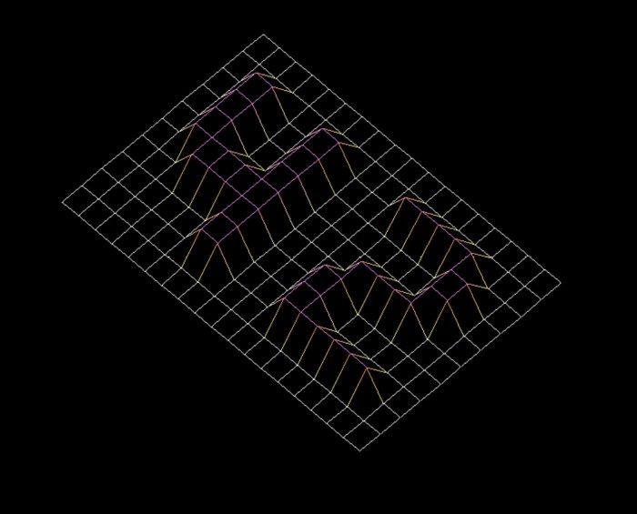

# fdf-final

FDF is the first project in the graphical brench, in this project I discovered the basics of graphic programming, and in particular how to place points in space, how to join them with segments and most importantly how to observe the scene from a particular viewpoint.

# Compiling and running
Run make. An executable will compile. Currently only tested on OS X.

Run it with ./fdf [map]. A bunch of sample maps are provided in the maps directory. The one in the screenshot above is maps/42.fdf.

Controls are: drag with left click to rotate, drag with right to zoom, drag with both to move around.

